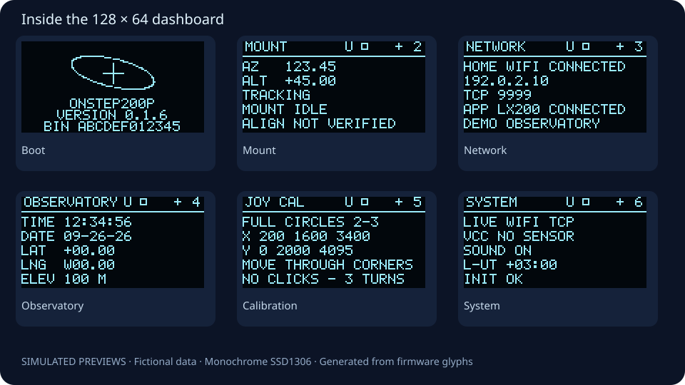

<p align="center"></p>

# OnStep200P

[](https://github.com/gabrsar/onstep200p/actions/workflows/ci.yml)
[](LICENSE)
[](docs/HARDWARE.md)

An ESP32-S3 controller for an Alt-Az telescope, built on **[OnStepX](https://github.com/hjd1964/OnStepX)**. It adds a small OLED dashboard, a calibrated joystick, and audible feedback to a Sky-Watcher 200P project.

**Development hardware, not a finished telescope controller.** Display, joystick, sound and Stellarium clock synchronization have been exercised on a bench. Motors were disconnected during validation. ALT gearing is provisional; physical limits, alignment, GoTo accuracy and tracking remain unverified. Read [hardware and commissioning](docs/HARDWARE.md) before connecting motors.

[Português](docs/README.pt-BR.md) · [Build](docs/BUILD.md) · [Controls](docs/CONTROLS.md) · [Protocol](docs/PROTOCOL.md) · [Roadmap](docs/ROADMAP.md)

## What it does

- Six OLED pages: mount, observatory, network, AP access, system and inputs.
- Joystick navigation, single-click page advance and three-circle calibration saved in NVS.
- USB and Wi-Fi LX200 control, with a single TCP listener on **9999**.
- Background connection to an optional home network, with an AP fallback.
- Boot, ready, connection, disconnection, calibration and error tones; persistent mute.
- A boot version and SHA-256 identifying the exact firmware image.
- A pinned upstream revision, host-side tests and credential-free CI builds.

### OLED preview



These are **generated previews**, not photographs or captured live telemetry. Their values and network names are fictional. Regenerate with `make previews`; see [visuals](docs/VISUALS.md). The SSD1306 itself is monochrome.

## Quick start

Requires Git, Make, Bash, Perl, ripgrep, a C++11 compiler, Python 3.10+ and [Arduino CLI](https://arduino.github.io/arduino-cli/). Linux and macOS are supported; use WSL for Windows.

```sh
git clone --recurse-submodules https://github.com/gabrsar/onstep200p.git
cd onstep200p
make setup                 # ESP32 core 2.0.17, EspSoftwareSerial 8.1.0
make test                  # Host logic and generated-source checks
make check                 # Tests + firmware build; does not upload
```

The validated target is **ESP32-S3 N16R8**, 16 MB flash, PSRAM disabled. CI pins Arduino CLI 1.5.1. Toolchain versions are recorded in [BUILD.md](docs/BUILD.md).

To upload an intentionally configured development build:

```sh
make install PORT=/dev/ttyACM0       # Linux example
# macOS: PORT=/dev/cu.usbmodemXXXX
```

Keep motors disconnected while using provisional gearing. `make install` uploads the last successful build; rebuild after changing options. `make all` also uploads—use `make check` for verification only.

## Connect a telescope app

Join the development AP **OnStep200P** (default password `onstepx200p`), or configure your home Wi-Fi privately. Use the IP shown on NETWORK and TCP port **9999**; AP address is `192.168.0.1`.

```sh
cp config/Wifi.example.h config/Wifi.local.h
# Edit the copy locally, then rebuild. Never commit it or distribute its binary.
```

The AP password is a public development default. Use a trusted, isolated network; LX200 has no authentication or encryption. Do not expose it to the Internet. Home Wi-Fi credentials are compiled into local firmware when supplied.

After every reboot, send **date, time and location from your app**. This profile has no automatic NTP/RTC source. The `SC` date acknowledgment includes the two classic LX200 status strings required by the tested Stellarium client. See [protocol and troubleshooting](docs/PROTOCOL.md).

## Controls at a glance

| Action | Behavior |
| --- | --- |
| Press joystick | Immediate stop request |
| One short click | Advance one page and beep after the multi-click window |
| Three short clicks | Toggle UI / mount control |
| Hold 1.5–5 s, release | Toggle persistent mute |
| Hold 5 s | Start calibration; rotate three times, click, then center for 3 s |

Mount-control mode can command motors. See [full controls](docs/CONTROLS.md) before use.

## Repository layout

```text
config/                 Board, pin map, private Wi-Fi example, date helpers
plugins/panelDisplay/   SSD1306 renderer and status indicators
plugins/panelJoystick/  Input filtering, calibration and manual motion
plugins/panelFeedback/  Nonblocking sounds, network state and diagnostics
scripts/               Source preparation, builds, tests and public audit
tests/                 Hardware-independent C++ tests and broker regression tests
docs/                  Hardware, protocol, architecture and generated previews
vendor/OnStepX/         Pinned upstream Git submodule; never edited in place
```

`scripts/prepare-source.sh` creates `.build/OnStepX`, applies guarded overlays and installs the plugins. Generated source and binaries are ignored. [Architecture](docs/ARCHITECTURE.md) explains the boundaries and [protocol review](docs/REVIEW.md) records limitations.

## Contributing and license

Issues and pull requests are welcome. Start with [CONTRIBUTING.md](CONTRIBUTING.md), use the templates and run `make quality` plus `make check`. Security-sensitive reports belong in [private vulnerability reporting](https://github.com/gabrsar/onstep200p/security/advisories/new), not public logs; see [SECURITY.md](SECURITY.md).

Licensed under **GNU GPL version 3**; see [LICENSE](LICENSE). This project builds on OnStepX and preserves its license and attribution. See [NOTICE.md](NOTICE.md) for upstream and reference credits. This is an independent hobby project, not an official OnStepX or Sky-Watcher product.
