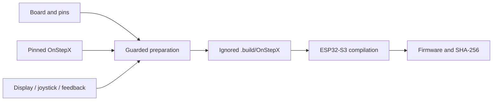

# Architecture

OnStep200P is an integration layer around a pinned OnStepX checkout.

`panelDisplay` owns the SSD1306 framebuffer, changed-chunk I²C updates and broker telemetry. `panelJoystick` owns filtering, gestures, calibration/NVS and motion requests. Its pure helpers are host-tested. `panelFeedback` owns boot/event audio, mute, connection state and diagnostics. Early audio uses a FreeRTOS task; later feedback uses the OnStep scheduler.

The local broker serializes queries and joystick requests. An overlay replaces slot-index ordering with FIFO sequence numbers and preserves stop retries. OnStepX owns clock/mount/motion state; plugins observe it or submit commands.

## Overlay policy

`scripts/prepare-source.sh` works on a disposable copy. Its groups cover configuration, broker/date compatibility, plugins and boot/network hooks. The upstream revision is checked first; marker assertions and prepared-source tests detect missing insertion points. Text-based overlays still require review on upstream upgrades.

Put substantial logic into tracked C++ helpers/plugins rather than long replacements. `LxDate.h` and `LxDateReply.h` illustrate that boundary. Never edit `vendor/OnStepX` or generated files and assume changes will survive preparation.

NVS stores calibration and mute, not a captured public device dump. The display distinguishes unknown values from measurements. See [review](REVIEW.md) and [protocol](PROTOCOL.md).
